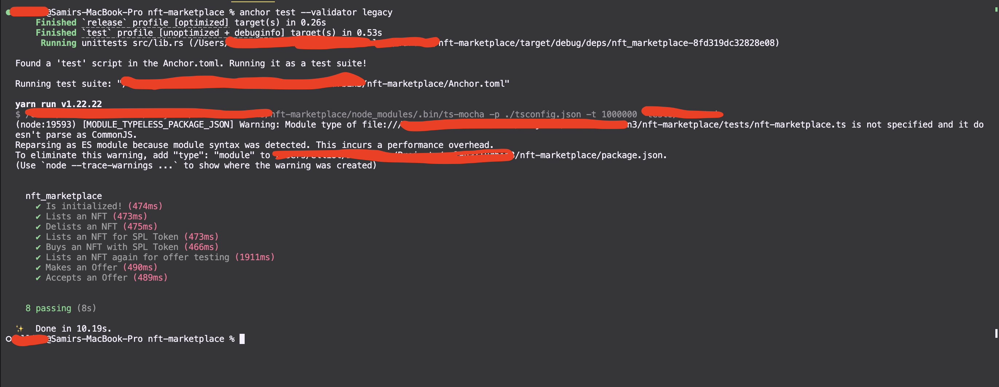
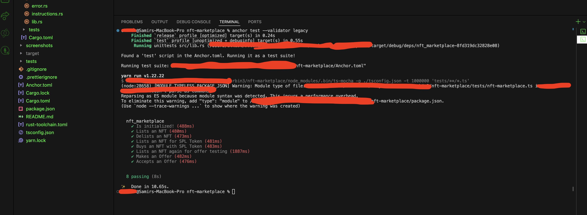

# NFT Marketplace - Solana (Turbin3 Assignment 2)

This repository contains the implementation of the NFT Marketplace smart contract built with Anchor on Solana. It includes features to list NFTs, delist them, buy with SOL or SPL tokens, and make/accept/cancel offers.

## Features Implemented
- `initialize`: Initialize the marketplace, setting up the treasury and fee structures.
- `list`: List an NFT for sale at a specific price. Supports both SOL and SPL token denominations.
- `delist`: Delist an active listing.
- `buy`: Buy a listed NFT using SOL. Splits funds between the maker and treasury (fee).
- `buy_with_token`: Buy a listed NFT using SPL tokens. Splits tokens between the maker and treasury via `transfer_checked`.
- `make_offer`: Escrow SOL into an Offer PDA to propose an alternative price for an NFT.
- `accept_offer`: Maker accepts the offer, receiving the escrowed SOL (minus fees), and transferring the NFT to the buyer.
- `cancel_offer`: Buyer cancels their pending offer and reclaims their escrowed SOL.

## Project Structure
- `programs/nft-marketplace/src/contexts/`: Contains all instruction logic contexts.
- `programs/nft-marketplace/src/state/`: Contains all state definitions (Marketplace, Listing, Offer).
- `tests/nft-marketplace.ts`: Contains full end-to-end integration tests for all features.

## Getting Started

### Prerequisites
- Node.js & Yarn
- Rust & Cargo
- Solana CLI
- Anchor CLI (1.0+)

### Installation
```bash
yarn install
```

### Build & Test
```bash
anchor build
anchor test --validator legacy
```

## Test Results

All 8 tests passing:



### Additional Screenshot


